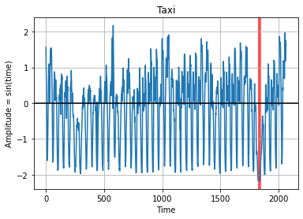

# Anomaly Detection
Data anomaly detection using pytorch encoder decoder

I have Detected an anomaly in the syntethic dataset. I have also provided a code to introduce the anomaly in the dataset.
In the training phase, the model learn the pattern of the dataset and generate minimum loss. Once trained, if data has an anomaly it will generate output based on learned probability, if it is not similar to input data, that means input has an anomaly.

# Sample output

